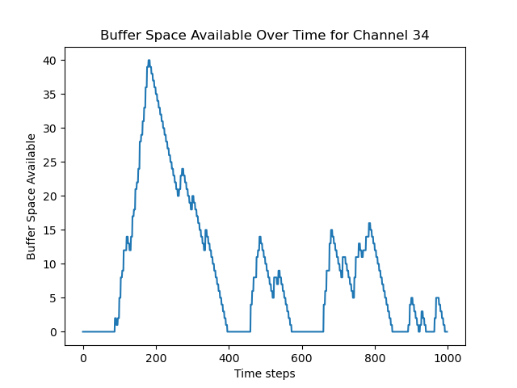

# System level modelling

This markdown logs down the experiment where the whole system will be simulated to provide us with important information we need.

For example, the FIFO size we need.

## 16 July

After the meeting on Tuesday 15 July, I started looking at the possibility of SystemC. It seems it is doable, and everything will be carried out and simulated by clock cycles. 

But the whole system will be written in C++, the data visualisation will be difficult together with signal processing.

But I still managed to build up the system C environment on my ubuntu machine where I simulated a simple counter and print out the signals in the waveform.


## 17 July

I just learnt a long way around where you can simulate system C using xcelium.

You can of course simulate a whole system C project.


The top test file is located in the [folder](./vending_machine/test_drink.cpp), to simulate it, simply run the command.

```tcl
xmsc_run *.cpp -layout cdebug -top test_drink -64BIT -scfrontend &
```

And then I also tried to simulate a verilog testbench with system c module instantiated.


The testbench can be found here, to simulate it, you need to run the command:

```tcl
xrun -svscdi -nocopyright -libverbose tb_fsm.v ./rtl/FSM_stub.v ./sc/FSM.cpp -64 -sysc
```

**System C file is defined in FSM.cpp, but direct porting from system C to verilog is not allowed, you need to create a verilog shell for it to run**

In this case FSM_stub.v is the verilog shell for FSM.


To instantiate verilog module in system C, you have to follow the definition below:

```verilog
///
// vchild.v (Instantiated Verilog module)
/// 
 `timescale 1ns/1ns
module vchild(in, out);
  input in;
  output out;
  reg outReg;
  initial begin
       outReg = 1'b0;
   #10 outReg = 1'b1;
   #10 outReg = 1'bx;
   #10 outReg = 1'bz;
   #10 outReg = 1'b0;
   #10 outReg = 1'b1;
   #10 outReg = 1'bx;
   #10 outReg = 1'bz;
   #10 $finish;
  end

  assign out = outReg;

  initial $monitor($time,,"in = %b, out = %b", in, out)
endmodule
```

```c++
//////
// sctop.h. (SystemC .h file)
/////

#include "systemc.h"

/* SystemC shell module for HDL module */
class vchild : public xmsc_foreign_module {
public:
  sc_in<sc_logic> in;
  sc_out<sc_logic> out;
  vchild(sc_module_name nm) : xmsc_foreign_module(nm),
   in("in"), out("out") { }
  const char* hdl_name() const { return "vchild"; } // XM mode name
};

/* Uses the shell module in another SystemC module */

class sctop : public sc_module {
public:
  SC_CTOR(sctop): port("port"), vlocal("vlocal") {
   vlocal.in(port);
   vlocal.out(port);
}
protected:
  vchild          vlocal;
  sc_signal<sc_logic> port;
};
```

```c++

//////
// sctop.cpp (SystemC .cpp file)
//////
#include "sctop.h"
XMSC_MODULE_EXPORT(sctop)
```

In the meantime, I made a very simple fifo module in python, which is written as a class.

Now I just have to do it in a very simple fashion.

I will try to hook them up tomorrow.


## 18 July

I have added a method to the Row based encoder 5P, now it can encode the data live, where it will record the repeating pattern and take 1 line of sensor data at a time.

After a simple test with the original encode_in_mem method, it proves to be the same results.

Now it will be better integrated with the data pipeline and we will see how they will be hooked to the FIFO.


## 21 July

I will now hook the data line up with the original Quantised image-->compression unit-->FIFO and track the FIFO


**Data used for this experiment is the most dense image of 500 per cc and 30 um particles!!!**


So apparently, after the simulation, it seems that if we keep the writing speed at 40MHz and reading at 20MHz, all we ever need is probably just 2 words for the FIFO.


#### What if we lower the reading frequency?

Considering our case if the LVDS IP is purchased, and it can handle up to 600 Mbps data transmission.

And there is a 16-bit to serial converter before it, which means it can send out 37.5 Million word per second. or 37.5 MHz.

And we are sharing one LVDS with 10 channels, therefore, each channel will get equivalent of 3.75 MHz reading speed at maximum.

Assume we read at 2.5 MHz for each channel, that will be 1/8 of the producing speed.

Simulate that again now...

Okay, with the worst channel of channel 1, we have the simulation of the worst case of 98 words used.

But the plot indicates an ever-increasing trend of the space that is used by the look of the plot.


#### Same case but read at 3.333333 MHz

If we read the FIFO at 3.33333 MHz, i.e. 1/6 of the writing rate. this would still be a problem probably......


#### Then how fast do we need to prevent overflowing?

Because the way this has been set up, I can only make the write to read ratio an integer. 

But so far, the conclusion is the write to read ratio should be **between 4 and 5**

**Case with 4**



**Case with 5**


Conclusion:

To prevent overflow, we might need the reading speed at around 5MHz for each channel.


## 22 July

After the experiment from yesterday, we can see that for an image with only 1000 lines, the buffer size of 256 is still enough.

But for a foreseeable future, it will run out very quickly.

I will generate a much longer image to test it out.

But also, what if we introduce the 1-bit encoding to the process?

I will first update the channel class to get the filter added.

The simple one-bit mode has been added to the channel class

## 23 July

I have just generated a longer image with 100 pixels and 20,000 rows.

Will quantise it and then feed it into the channel class to see how it will react.

Also just realised the runs I made yesterday has the configuration of **500 per cc** and mean size of **20 um**

With the testing of the following configuration:

+ writing speed at 20MHz, sometimes 1 word, sometimes 2 words
+ FIFO depth 256
+ FIFO width 16
+ reading speed at 5MHz always 1 word at a time
+ arm separation 0.2

256 words are enough for this case, max word use is 78.


When reading speed is 4 MHz, 256 FIFO depth is still enough and max word use is 135


When reading speed is 3.33333 MHz, 256 FIFO depth is **NOT** enough, but 512 would suffice. The max word use is 415.

However, this does not look safe:


I think this agrees with the conclusion made from yesterday where the safe reading speed should be no less than 4 MHz.

But for a less dense case like when arm separation is 0.06, even 128 would be sufficient for reading speed at: 3.33 MHz, 2.86 MHz and 2.5 MHz.

I will test out the case when FIFO is full, if the 1-bit mode will help.

## 24 July

Since we have had the test where 256-word deep FIFO is not enough for the reading speed of 3.3333 MHz.

I will try to turn the one bit mode on and see if that will help.

I have recreated the case for reading speed of 3.33 MHz with one-bit-mode turned on. 

It seems this cannot change the fact that it will be full eventually.


With one-bit mode turned on, it only extended the filling of the FIFO by few time steps.

10281 - 10268 = 13

only 13 steps were saved, this is not helpful in this case.

We should either rethink about this one-bit mode or just not do it at all in this case.

In the meantime, I will generate a new batch of data with the configuration of **500 per cc** and mean size of **30 um**


## 25 July

To clarify, when I say "rethink about one-bit mode", I mean thinking of something that would actually help save space.

Still waiting for the image generation to complete....

Image generation has completed, the test on these images showed that the encoder will struggle with images where arm separation is 0.2. will plot out the image and compare to see if the image is too dense in the normal context.

## 28 July

Just wrote up the arbiter class and encapsulated the whole 5 channels and arbiter into one data line class.

So far, the arbiter will only pop data of each FIFO by order. If the FIFO is empty, it will skip this FIFO and do nothing.

Therefore, the arbiter will work in the same clock cycle as each diode producer, i.e. 20 MHz.

Test on 20k row image with the particle density of **500 per cc** and mean size of **30 um**

The test is based off the following configuration:

+ writing speed at 20MHz, sometimes 1 word, sometimes 2 words
+ FIFO depth 256
+ reading speed at 20MHz round robin among 5 channels
+ arm separation 0.06

So far, the images under the construction of 5 channels per arbiter round robin has been working alright with image 006 and the max space used across the data line is 80 words.


But if I set up the Data line to run arm separation of 0.2, it will fail pretty quickly with all the FIFOs filled up.


## 29 July

Following the meeting today, I will list up all the possible arbiter mechanism I can think of right now:

#### Weighted Round Robin

Assign weights based on FIFO fullness, more full FIFOs get more priority

Problem here: You need to track FIFO fullness...


#### Urgency-Based Arbitration

Prioritise FIFOs that are close to full

Compare FIFO fill levels each cycle and assign priority to the FIFO with the highest occupancy.

Some kinda of FIFO usage level may be needed, or "almost_full" flag, and how much should one session read at a time?


#### Priority + Ageing

Assign static priorities but gradually increase "urgency" for low-priority FIFOs that haven't been served in a while.


#### Token Bucket

Give each FIFO a token bucket, a FIFO can transmit only if it has tokens.


## 30 July

So I checked quickly, it is possible to have a quick conversion from Gray code back to Binary. 

Conversion should look like:

```text
B[n-1] = G[n-1]                   // MSB is the same
B[i]   = B[i+1] XOR G[i]          // for i = n-2 down to 0
```

This translates to the following verilog, if there are fixed 4 bits of gray code:

```verilog
B[3] = G[3];
B[2] = G[3] ^ G[2];
B[1] = G[3] ^ G[2] ^ G[1];
B[0] = G[3] ^ G[2] ^ G[1] ^ G[0];
```


## 12 Aug

I have the Urgency based algorithm written in verilog, the overall algorithm is defined as follow:


Input:

Space used across 5 different channels --> data_used [4:0]

FIFO empty flags --> fifo_empty [4:0]

Output:

Grant_one_hot --> grant_one_hot [4:0]


Internal register:

urgency [4:0]
age [4:0]
grant [2:0]


```text

for id in range(5):
  if(fifo_empty[id])
    age[id] = 0
    urgency[id] = 0
  else if(grant == id)
    age[id] = 0
  else if(age[id] < 255)
    age[id] += 1

  urgency[id] = (data_used[id] << 2) + age [id]

grant = maxid(urgency)
grant_one_hot = OneHot(grant) 
```

## 14 Aug

I will write up a new arbiter class based on the old round robin arbiter class.

It will be called ArbiterUrgency and it should have the same methods as the base class **arbiter**.

I finished drafting for the class ArbiterUrgency, will now plug it in to test the stressful cases.

And it appears that this arbiter does a better job at keeping all the channels fair and tried to pop the data whenever it could.

But due to the high throughput of the channel, it simply cannot cope the demand.


